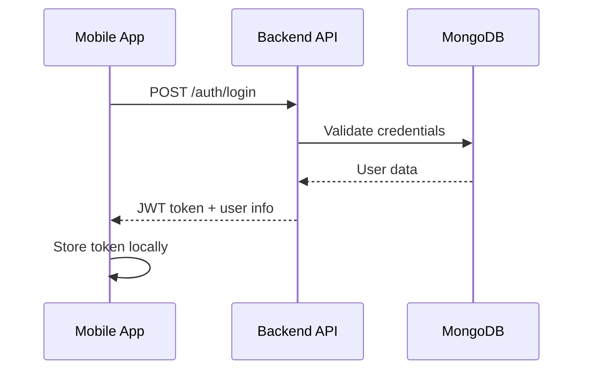
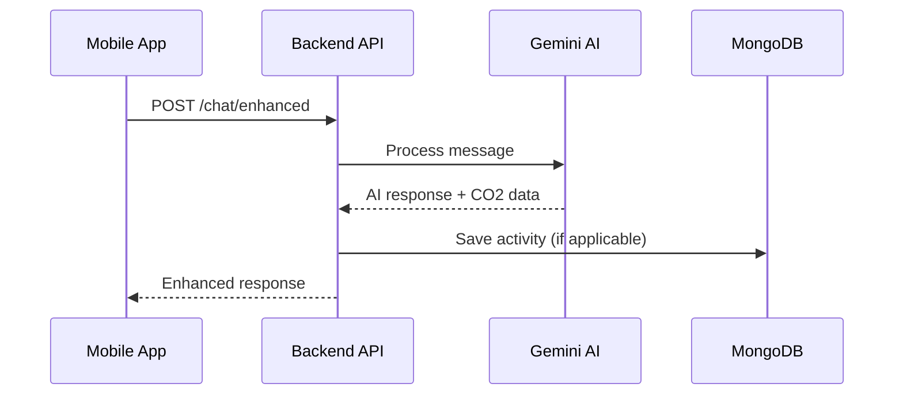

# EcoTrack - Carbon Footprint Tracking Application


EcoTrack is a comprehensive mobile application that helps users track, monitor, and reduce their carbon footprint through intelligent habit tracking, AI-powered insights, and community engagement.

## 🌱 Overview

EcoTrack combines modern mobile technology with environmental consciousness to provide users with:
- Real-time carbon footprint tracking
- AI-powered sustainability recommendations
- Habit formation and goal setting
- Community challenges and motivation
- Detailed analytics and reporting

## 🏗️ Technical Architecture

### System Architecture

```
┌─────────────────────────────────────────────────────────────┐
│                    EcoTrack Application                     │
├─────────────────────────────────────────────────────────────┤
│                                                             │
│  ┌─────────────────┐    ┌─────────────────────────────────┐ │
│  │                 │    │                                 │ │
│  │   Mobile App    │◄──►│        Backend API              │ │
│  │   (Frontend)    │    │        (Node.js)                │ │
│  │                 │    │                                 │ │
│  └─────────────────┘    └─────────────────────────────────┘ │
│                                        │                    │
│                                        ▼                    │
│  ┌─────────────────┐    ┌─────────────────────────────────┐ │
│  │                 │    │                                 │ │
│  │   AI Services   │◄──►│      Database Layer             │ │
│  │   (Gemini AI)   │    │      (MongoDB Atlas)            │ │
│  │                 │    │                                 │ │
│  └─────────────────┘    └─────────────────────────────────┘ │
│                                                             │
└─────────────────────────────────────────────────────────────┘
```

### Technology Stack

#### Frontend (Mobile Application)
- **Framework**: React Native with Expo (SDK 54)
- **Navigation**: Expo Router with React Navigation
- **State Management**: React Context API
- **Styling**: React Native StyleSheet with custom theme system
- **UI Components**: Custom components with Material Design icons
- **Storage**: AsyncStorage for local data persistence
- **Build System**: EAS Build for APK/IPA generation

#### Backend (API Server)
- **Runtime**: Node.js
- **Framework**: Express.js
- **Database**: MongoDB Atlas (Cloud)
- **ODM**: Mongoose
- **Authentication**: JWT (JSON Web Tokens)
- **Password Security**: bcryptjs
- **AI Integration**: Google Gemini AI
- **CORS**: Cross-Origin Resource Sharing enabled
- **Logging**: Morgan for HTTP request logging

#### External Services
- **AI Provider**: Google Gemini AI for natural language processing
- **Database**: MongoDB Atlas for cloud data storage
- **Build Service**: Expo Application Services (EAS)

## 📱 Frontend Architecture

### Project Structure
```
frontend/
├── app/                          # Expo Router pages
│   ├── (tabs)/                   # Tab-based navigation
│   │   ├── habits.tsx            # Habit tracking screen
│   │   ├── assistant.tsx         # AI chat interface
│   │   ├── goals.tsx             # Goal management
│   │   ├── motivation.tsx        # Motivation hub
│   │   └── profile.tsx           # User profile
│   ├── auth.tsx                  # Authentication screen
│   ├── onboarding.tsx            # User onboarding flow
│   └── _layout.tsx               # Root layout
├── components/                   # Reusable components
│   ├── ui/                       # Base UI components
│   ├── chat/                     # Chat-related components
│   ├── AuthGuard.tsx             # Authentication wrapper
│   ├── CustomTabBar.tsx          # Custom tab navigation
│   └── EcoTrackLogo.tsx          # Brand logo component
├── contexts/                     # React Context providers
│   ├── AuthContext.tsx           # Authentication state
│   └── ThemeContext.tsx          # Theme management
├── services/                     # API and external services
│   ├── apiConfig.ts              # Dynamic API configuration
│   ├── authAPI.ts                # Authentication services
│   ├── chatAPI.ts                # Chat/AI services
│   └── profileAPI.ts             # Profile management
├── constants/                    # App constants
│   └── theme.ts                  # Theme definitions
├── types/                        # TypeScript type definitions
└── utils/                        # Utility functions
```

### Key Frontend Features

#### 1. **Dynamic API Configuration**
- Automatic network detection for development
- Smart fallback URLs for different environments
- Cached working URL persistence

#### 2. **Authentication System**
- JWT-based authentication
- Secure token storage
- Auto-refresh mechanisms
- Route protection with AuthGuard

#### 3. **AI Chat Interface**
- Real-time chat with Gemini AI
- Multilingual support (English/Sinhala)
- Context-aware responses
- Activity parsing and CO2 calculations

#### 4. **Theme System**
- Light/Dark mode support
- System theme detection
- Consistent color palette
- Responsive design patterns

## 🔧 Backend Architecture

### Project Structure
```
backend/
├── config/                       # Configuration files
│   ├── config.js                 # App configuration
│   └── database.js               # Database connection
├── controllers/                  # Request handlers
│   ├── authController.js         # Authentication logic
│   ├── chatController.js         # Chat functionality
│   ├── habitController.js        # Habit management
│   ├── motivationController.js   # Motivation features
│   └── profileController.js      # Profile management
├── middleware/                   # Express middleware
│   └── auth.js                   # JWT authentication
├── models/                       # MongoDB schemas
│   ├── User.js                   # User model
│   ├── Activity.js               # Activity tracking
│   ├── HabitLog.js               # Habit logging
│   ├── Badge.js                  # Achievement system
│   └── CommunityPost.js          # Community features
├── routes/                       # API route definitions
│   ├── authRoutes.js             # Authentication endpoints
│   ├── chatRoutes.js             # Chat endpoints
│   ├── habitRoutes.js            # Habit endpoints
│   └── profileRoutes.js          # Profile endpoints
├── services/                     # Business logic services
│   ├── ecotrackAI.js             # AI service integration
│   ├── geminiService.js          # Gemini AI wrapper
│   ├── co2Service.js             # Carbon calculations
│   └── badgeService.js           # Achievement logic
└── index.js                      # Server entry point
```

### API Architecture

#### RESTful Endpoints
```
Authentication:
POST   /api/v1/auth/login         # User login
POST   /api/v1/auth/register      # User registration
GET    /api/v1/auth/user          # Get current user

Chat/AI:
POST   /api/v1/chat/simple        # Simple chat
POST   /api/v1/chat/enhanced      # Enhanced chat with context
GET    /api/v1/chat/status        # AI service status

Habits:
GET    /api/v1/habits             # Get user habits
POST   /api/v1/habits             # Create habit
PUT    /api/v1/habits/:id         # Update habit
DELETE /api/v1/habits/:id         # Delete habit

Profile:
GET    /api/v1/profile            # Get user profile
PUT    /api/v1/profile            # Update profile
POST   /api/v1/profile/quiz       # Submit onboarding quiz

Motivation:
GET    /api/v1/motivation/tips    # Get AI tips
GET    /api/v1/motivation/quotes  # Get motivational quotes
POST   /api/v1/motivation/challenge # Update challenge progress
```

### Database Schema

#### User Model
```javascript
{
  name: String,
  email: String (unique),
  password: String (hashed),
  profileImage: String,
  completedOnboarding: Boolean,
  carbonProfile: {
    baselineCO2: Number,
    goals: {
      daily: Number,
      weekly: Number,
      monthly: Number
    },
    lifestyle: String
  },
  createdAt: Date,
  updatedAt: Date
}
```

#### Activity Model
```javascript
{
  userId: ObjectId,
  type: String,
  description: String,
  co2Amount: Number,
  category: String,
  date: Date,
  processed: Boolean
}
```

#### HabitLog Model
```javascript
{
  userId: ObjectId,
  habitId: ObjectId,
  date: Date,
  completed: Boolean,
  co2Saved: Number,
  notes: String
}
```

## 🤖 AI Integration

### Gemini AI Service
- **Natural Language Processing**: Understands user activities in multiple languages
- **Carbon Footprint Calculation**: Automatically calculates CO2 emissions from activities
- **Personalized Recommendations**: Provides tailored sustainability tips
- **Multilingual Support**: English and Sinhala language processing

### AI Features
1. **Activity Parsing**: Converts natural language to structured activity data
2. **Smart Suggestions**: Context-aware environmental tips
3. **Conversational Interface**: Natural chat experience
4. **Cultural Adaptation**: Localized content for different regions

## 🔒 Security Features

### Authentication & Authorization
- **JWT Tokens**: Secure, stateless authentication
- **Password Hashing**: bcryptjs with salt rounds
- **Route Protection**: Middleware-based access control
- **Token Refresh**: Automatic token renewal

### Data Protection
- **Environment Variables**: Sensitive data in .env files
- **CORS Configuration**: Controlled cross-origin access
- **Input Validation**: Request data sanitization
- **Error Handling**: Secure error messages

## 🚀 Development & Deployment

### Development Setup
```bash
# Clone repository
git clone https://github.com/Y3S1-WE20/EcoTrack.git
cd EcoTrack

# Backend setup
cd backend
npm install
cp .env.example .env  # Configure environment variables
npm run dev

# Frontend setup
cd ../frontend
npm install
npx expo start
```

### Environment Configuration
```bash
# Backend (.env)
MONGODB_URI=mongodb+srv://...
DATABASE_NAME=EcoTrack
GEMINI_API_KEY=your_gemini_key
JWT_SECRET=your_jwt_secret
PORT=4000

# Frontend (automatic detection)
# API URLs configured dynamically
```

### Build & Deployment
```bash
# Mobile app build
cd frontend
eas build --platform android --profile preview
eas build --platform ios --profile preview

# Backend deployment (example)
# Deploy to Heroku, Railway, or other Node.js hosting
```

## 📊 Performance Considerations

### Frontend Optimizations
- **Lazy Loading**: Component-based code splitting
- **Image Optimization**: Expo Image with caching
- **State Management**: Efficient Context usage
- **Memory Management**: Proper cleanup in useEffect

### Backend Optimizations
- **Database Indexing**: Optimized MongoDB queries
- **Connection Pooling**: Mongoose connection management
- **Response Caching**: Strategic API response caching
- **Error Boundaries**: Graceful error handling

## 🔄 API Flow Examples

### User Authentication Flow


### AI Chat Interaction


## 🧪 Testing Strategy

### Frontend Testing
- **Component Testing**: React Native Testing Library
- **E2E Testing**: Expo testing tools
- **Manual Testing**: Device and simulator testing

### Backend Testing
- **Unit Tests**: Jest for individual functions
- **Integration Tests**: API endpoint testing
- **Load Testing**: Performance under load

## 📈 Monitoring & Analytics

### Application Monitoring
- **Error Tracking**: Built-in error boundaries
- **Performance Metrics**: App startup and response times
- **User Analytics**: Feature usage tracking
- **AI Service Monitoring**: Response quality and latency

### Database Monitoring
- **Query Performance**: MongoDB Atlas monitoring
- **Connection Health**: Database connectivity status
- **Data Growth**: Storage and performance trends

## 🔮 Future Enhancements

### Planned Features
1. **Social Features**: Friend connections and challenges
2. **IoT Integration**: Smart device data integration
3. **Blockchain**: Carbon credit tokenization
4. **Advanced AI**: Predictive analytics and recommendations
5. **Offline Mode**: Complete offline functionality

### Technical Improvements
1. **Microservices**: Service decomposition
2. **Real-time Features**: WebSocket integration
3. **Enhanced Security**: OAuth2 and 2FA
4. **Performance**: Advanced caching strategies

## 📄 License

This project is licensed under the MIT License - see the [LICENSE](LICENSE) file for details.

## 🤝 Contributing

1. Fork the repository
2. Create a feature branch (`git checkout -b feature/amazing-feature`)
3. Commit your changes (`git commit -m 'Add amazing feature'`)
4. Push to the branch (`git push origin feature/amazing-feature`)
5. Open a Pull Request

## 📞 Contact

- **Project Lead**: Shalon Fernando
- **Email**: shalonfernando@ecotrack.app
- **Repository**: https://github.com/Y3S1-WE20/EcoTrack

---

**EcoTrack** - Making the world greener, one habit at a time 🌱